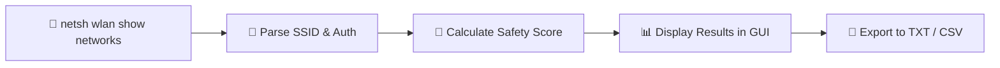

<p align="center">
  
</p>

<h1 align="center">🛡️ WiFi Safety Checker</h1>

<p align="center">
  <strong>A cross-platform desktop application that scans nearby WiFi networks, analyzes their security posture, and assigns a safety score to help you avoid risky connections.</strong>
</p>

<p align="center">
  <a href="#features"></a>
  <a href="#quick-start"></a>
  <a href="#how-it-works"></a>
  <a href="#license"></a>
</p>

<p align="center">
  
  
  
  
</p>

---

## 📖 About

**WiFi Safety Checker** is a lightweight security tool designed for everyday users and IT professionals alike. When you connect to a public WiFi network — at a coffee shop, airport, or mall — you're exposed to potential threats like unencrypted traffic interception, rogue access points, and man-in-the-middle attacks.

This application provides **instant visibility** into the security status of every WiFi network in range, helping you make informed decisions before connecting.

> Built with **Python (Tkinter)** for rapid prototyping and **C++ (Qt)** for high-performance deployment.

---

## ✨ Features

| Feature | Description |
|---|---|
| 🔍 **Network Scanning** | Discovers all nearby WiFi networks using native OS commands |
| 📊 **Safety Scoring** | Assigns a score (0–100) based on encryption, naming patterns, and duplication |
| ⚠️ **Threat Detection** | Flags open networks, WEP encryption, suspicious SSIDs, and Evil Twin attacks |
| 🌐 **IP Display** | Shows your current IP address alongside your connected network |
| 🕐 **Live Timestamp** | Real-time clock display within the application window |
| 📁 **Export Results** | Save scan results to `.txt` or `.csv` for auditing and documentation |
| 🧪 **Unit Tested** | Includes test suites for both Python and C++ implementations |

---

## 🔐 Scoring Algorithm

Each detected network starts with a base score of **100/100**. Penalties are applied based on risk indicators:

```
┌─────────────────────────────────────────────────────┐
│  Risk Factor              │  Python  │    C++       │
├───────────────────────────┼──────────┼──────────────┤
│  Open Authentication      │  -50     │    -60       │
│  WEP Encryption           │  -40     │    -50       │
│  WPA (without WPA2)       │   —      │    -20       │
│  Suspicious Keywords      │  -10     │     —        │
│  Duplicate SSID (Evil Twin) │ -30    │    -20       │
└─────────────────────────────────────────────────────┘
```

**Risk Levels** (C++ version):
- 🟢 **LOW RISK** — Score ≥ 80
- 🟡 **MEDIUM RISK** — Score 50–79
- 🔴 **HIGH RISK** — Score < 50

---

## 🚀 Quick Start

### Python Version

```bash
# 1. Clone the repository
git clone https://github.com/KinLawrence/WifiSafetyCheckerApp.git
cd WifiSafetyCheckerApp

# 2. (Optional) Create a virtual environment
python -m venv venv
venv\Scripts\activate

# 3. Run the application
python python3/app.py
```

> **Note:** No external dependencies required — uses Python standard library only (`tkinter`, `subprocess`, `csv`).

### C++ Version (Qt)

```bash
# 1. Ensure Qt6 is installed and configured
# 2. Build with CMake or qmake
cd cplusplus
qmake && make        # Linux/macOS
# OR open in Qt Creator on Windows

# 3. Run the compiled binary
./WifiSafetyChecker
```

---

## 🧪 Running Tests

### Python

```bash
python -m unittest python3/test.py
```

### C++

```bash
cd cplusplus
g++ -std=c++17 test.cpp -o test -lQt6Core -lQt6Widgets
./test
```

---

## 🔍 How It Works



1. **Scan** — Executes `netsh wlan show networks mode=bssid` to enumerate nearby access points
2. **Parse** — Extracts SSID names and authentication types from raw command output
3. **Score** — Applies the security scoring algorithm against each network
4. **Display** — Renders results in a GUI with color-coded risk indicators
5. **Export** — Allows saving results with timestamps for future reference

---

## 📂 Project Structure

```
WifiSafetyCheckerApp/
├── python3/
│   ├── app.py              # Python GUI application (Tkinter)
│   └── test.py             # Python unit tests
├── cplusplus/
│   ├── app.cpp             # C++ GUI application (Qt)
│   └── test.cpp            # C++ unit tests
├── assets/
│   └── banner.png          # Repository banner image
├── network_scan_log_*.txt  # Sample scan output logs
├── network_scan_log_*.csv  # Sample scan output (CSV)
└── README.md
```

---

## 🛠️ Tech Stack

- **Python 3** — Tkinter GUI, subprocess for system commands
- **C++17** — Qt6 framework for cross-platform native GUI
- **Windows `netsh`** — Native wireless network enumeration

---

## 🤝 Contributing

Contributions are welcome! Here are some ideas for future enhancements:

- [ ] macOS support via `airport` command
- [ ] Linux support via `iwlist` / `nmcli`
- [ ] Network history tracking and trend analysis
- [ ] Notification alerts for high-risk connections
- [ ] Dark mode theme for the GUI

1. Fork the repository
2. Create a feature branch (`git checkout -b feature/amazing-feature`)
3. Commit your changes (`git commit -m 'Add amazing feature'`)
4. Push to the branch (`git push origin feature/amazing-feature`)
5. Open a Pull Request

---

## 📄 License

This project is licensed under the [MIT License](LICENSE).

---

<p align="center">
  Made with ❤️ by <a href="https://github.com/KinLawrence">KinLawrence</a>
</p>
